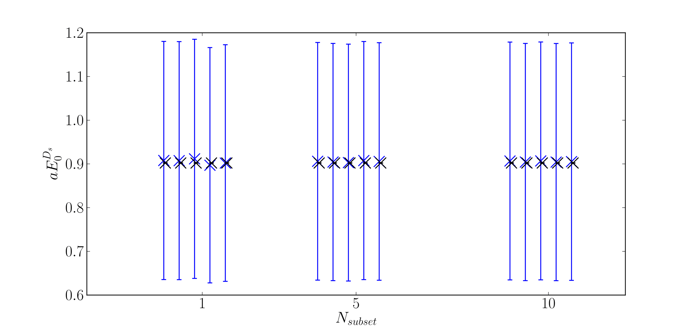
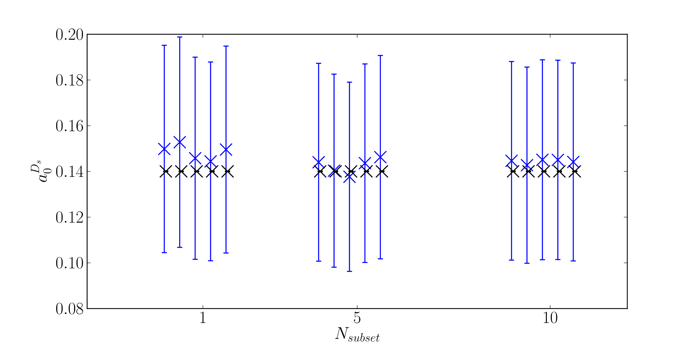
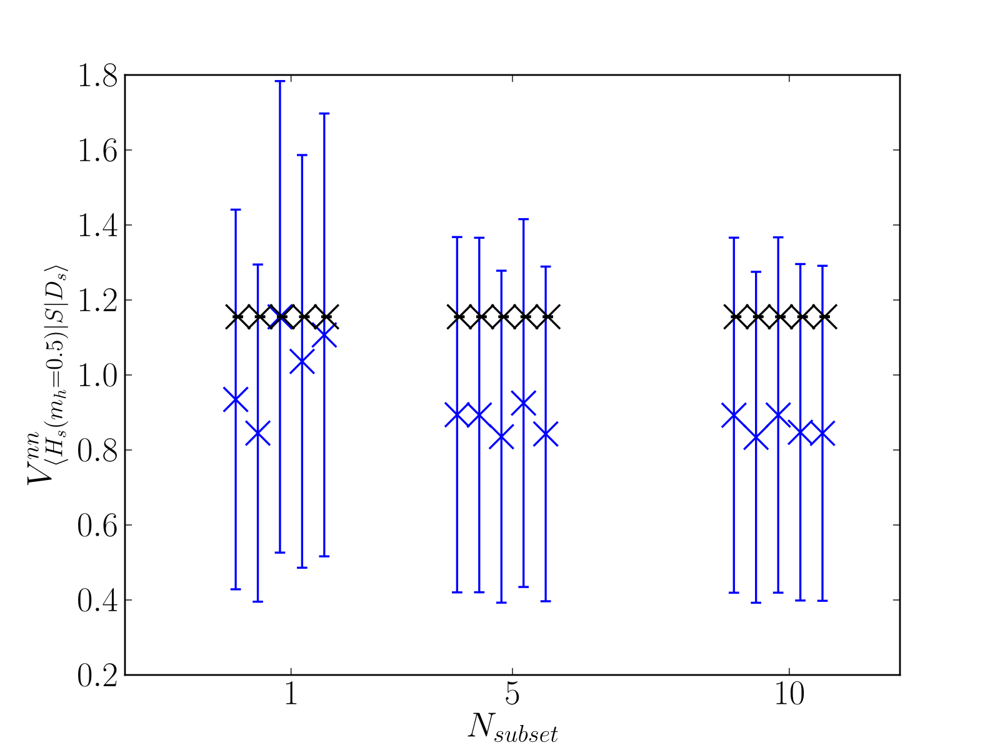

More Details
============

How it works
------------

Getting good priors from a single correlator is possible due to the nice properties of correlation functions in QCD. 
The effective mass of a single correlator gives a good estimate of the true mass for example. We first take the sacrificed correlator and perform a second-order superaverage

C(t) -> ( C(t-1) - 2C(t) + C(t+1) ) / 4 

This drowns out any effects from oscillating states in the case of staggered quarks. Then, the prior for the ground state energy is calculated via

E_0 = [ mean over t=t_cut -> t=T_lat/2-t_cut ] log( C(t) / C(t+1) )

The variance of this is inflated by 30% (one can choose a custom amount using the optional argument "loosener").
t_cut is another optional argument, with a default of T_lat/10.

Similarly, the ground state amplitude is given by

a_0 = [ mean over t=t_cut -> t=T_lat/2-t_cut ] sqrt( C(t) * e^{ E_0 t } ) * 30% additional error

The excited state parameters are computed by transforming the correlator ( C(t) -> C(t) - a_0^2 * exp( - E_0 t ) ),
then finding E_0 and a_0 values in the same way as above on this transformed correlator.

Priors for oscillaing states are guessed from knowledge of the non-oscillating states, i.e. basically the same with larger errors.

3-point amplitudes are estimated using the ratio

R = [ mean over t=t_cut -> t=T-t_cut ] ( C_{3pt}(t)/ C_{2pt,1}(t) * C_{2pt,2}(T-t) ),

where the C_{2pt,1/2} are the correlators for the two states on either side of the current. t is the timeslice of the current and T is the source/sink temporal separation. This ratio is equal to J/(a_1 * a_2), where J is the transition amplitude and a_{1/2} are the amplitudes of the 2-point correlators. Then we find J = R * a_1 * a_2. The rest of the 3-point priors, those coupling to oscillating states and excited states, are generically set to ``0.0(1.0)``.

Some Tests
----------

I ran some tests.

This is the ground state energy of a D_s meson, computed using the HISQ action on the MILC 2+1+1 ensembles. N_subset is the number of points used
to deduce priors, which are shown in blue. The black points are fit results from fitting 986-N_subset correlators using corrfitter, using these
priors. I ran each test 5 times (hence 5 points per N_subset choice), each with a different randomly chosen subset.

Here is the same thing for the ground state amplitude:

And for a 3-point amplitude of a scalar current between a Ds meson and a heavy-strage meson (with heavy mass = 0.5):

